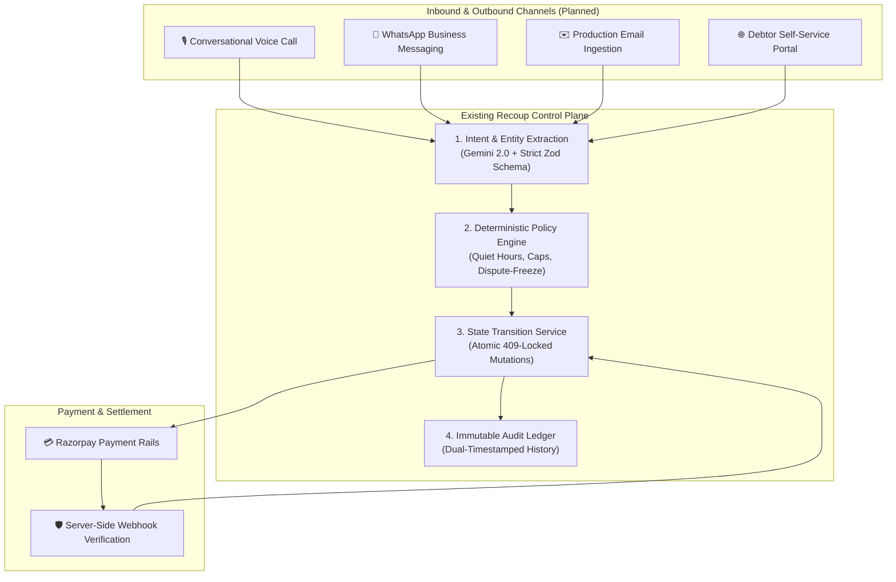

# 🗺️ Recoup — Product Roadmap & Future Horizons

> **Status:** Recoup is currently a verified Buildathon prototype. This roadmap describes how the same recovery control plane could evolve into a production system.
>
> **Core Principle:** *AI interprets. Policy decides. The state machine enforces. The audit ledger proves.*

---

## 🎯 Executive Vision

Recoup addresses the primary operational risks of receivables recovery: **unstructured promises, unverified payments, and unconstrained agent autonomy**.

The system establishes a strict separation between intelligence and financial authority. Phase 1 built and verified the deterministic core engine. Subsequent phases expand Recoup from a single-workspace prototype into an omnichannel, ERP-connected receivables operating system.

```
┌────────────────────────────────────────────────────────────────────────────────────────────────┐
│                                   RECOUP ROADMAP AT A GLANCE                                   │
├──────────────────────────┬───────────────────────────┬─────────────────────────────────────────┤
│ HORIZON 1: THE CORE      │ HORIZON 2: OMNICHANNEL    │ HORIZON 3: ENTERPRISE & ERP             │
│ [Current · Verified Prototype]│ [Planned Next]       │ [Longer-Term Vision]                    │
├──────────────────────────┼───────────────────────────┼─────────────────────────────────────────┤
│ • 10-State Case Machine  │ • WhatsApp Messaging      │ • Two-Way ERP Sync (Tally, Zoho, SAP)   │
│ • 8-Status Commitments   │ • Production Email Flow   │ • Merchant & Team Workspaces (RBAC)     │
│ • Dispute-Freeze Guard   │ • Voice Telephony Channel │ • Recovery Economics & DSO Analytics    │
│ • Gemini 2.0 Zod Parser  │ • Debtor Self-Serve Portal│ • Multi-Installment Payment Plans       │
│ • RLS + 409 Concurrency  │ • Governed Settlement Rule│                                         │
│ • 234 Automated Tests    │                           │                                         │
│ • Razorpay Test Mode     │                           │                                         │
└──────────────────────────┴───────────────────────────┴─────────────────────────────────────────┘
```

---

## 🚀 Product Horizons

### 📍 Horizon 1: The Core Control Plane *(Current · Verified Prototype)*

The current implementation focuses on architectural determinism, complete state coverage, and server-verified payment reconciliation.

* ✅ **Two-Tier State Machine:** Decoupled `recovery_cases` (10 states) from individual `commitments` (8 statuses) to model real debtor lifecycles accurately.
* ✅ **Zero-Tool LLM Boundary:** Google Gemini 2.0 Flash operates strictly as an entity parser with strict Zod JSON schema validation, possessing zero direct database write permissions.
* ✅ **Dispute-Freeze Financial Guardrail (ADR 0006):** Commitments are frozen (`is_frozen = true`) upon dispute detection rather than cancelled or discarded, preserving the evidence trail for human review.
* ✅ **Optimistic Concurrency & DB Safety:** Optimistic concurrency with `409 Conflict` handling, PostgreSQL persistence, and Row Level Security (RLS) default-deny policies.
* ✅ **Razorpay Test Mode Integration:** Integrated with Razorpay Standard Checkout (`checkout.js`), server-side raw-body HMAC-SHA256 webhook signature verification, two-tier DB idempotency, automated case transition to `CLOSED_PAID`, and immutable audit logging. *(Operates safely in Test Mode; no live capital charged).*
* ✅ **Simulated Business Clock:** Injected clock interface enabling time-travel evaluation with dual timestamps (`simulated_at` vs `wall_clock_at`) on every audit event.
* ✅ **Automated Verification:** **234 automated tests** across 17 test suites, with a **200-case synthetic receivables benchmark** (Fixed Baseline: ₹1,24,77,150 invoiced book, ₹50,05,977 recovered, 40.12% portfolio recovery rate).

---

### 🎙️ Horizon 2: Omnichannel Channels & Interactive Outreach *(Planned Next)*

Expanding communication channels while routing every interaction into the **same verified control plane**:



#### Planned Capabilities:
1. **WhatsApp Business Messaging:** Automated dispatch of structured reminders with embedded Razorpay payment links and interactive response handling.
2. **Production Email Thread Ingestion:** Bidirectional email processing that automatically maps inbound customer replies to active recovery cases.
3. **Conversational Voice Telephony:** Real-time phone outreach capturing spoken debtor commitments and feeding structured promises directly into the policy engine.
4. **Debtor Self-Service & Dispute Portal:** Tokenized magic links enabling debtors to review invoices, upload dispute documentation, or select structured payment arrangements.
5. **Governed Early-Settlement Strategies:** Policy-bounded prompt-pay discount ladders and partial payment plans enforced deterministically without agent discretion.

---

### 🏢 Horizon 3: Enterprise Financial OS & Integrations *(Planned)*

Deepening integration into merchant financial infrastructure:

1. **Two-Way ERP & Accounting Sync:**
   * Automated ingestion of overdue invoices from platforms such as Tally, Zoho Books, QuickBooks, and SAP.
   * Automated ledger reconciliation and payment write-backs upon successful recovery.
2. **Merchant & Team Workspaces (RBAC):**
   * Role-Based Access Control (`Admin`, `Finance Manager`, `Collection Officer`, `Auditor`).
   * Team-based case queues and multi-tier approval workflows for manual overrides and write-offs.
3. **Recovery Economics & DSO Analytics:**
   * Executive reporting on Days Sales Outstanding (DSO) acceleration, interest-loss reduction, and recovery yields across aging buckets.
4. **Structured Multi-Installment Governance:**
   * Policy-enforced multi-stage payment plans with scheduled monitoring and automated milestone tracking.

---

### 🌐 Horizon 4: Advanced Capital Management *(Longer-Term Vision)*

Longer-term enterprise expansion may include financing and advanced capital-management capabilities, subject to product, risk, regulatory, and platform constraints.

---

## 💳 Future Razorpay Integration Opportunities

| Stage | Integration Area | Current / Future Status | Role in Platform |
| :--- | :--- | :--- | :--- |
| **Current** | **Razorpay Standard Checkout** | `VERIFIED TEST MODE` | Case-linked payment interface with contextual invoice metadata |
| **Current** | **Razorpay Webhooks API** | `VERIFIED TEST MODE` | Authoritative server-side HMAC-SHA256 signature verification & reconciliation |
| **Future** | **Razorpay Payment Links (`rzp.io`)** | `PLANNED` | Dynamic link generation for automated WhatsApp/SMS dispatch |
| **Future** | **Razorpay Route** | `EXPLORATORY` | Automated split-settlement for recovery fees and partner payouts |

---

## 🛡️ Non-Negotiable Engineering Tenets

Throughout all planned phases, Recoup strictly preserves three foundational guarantees:

1. **Deterministic Authority:** The LLM interprets language; the Policy Engine and State Transition Service own all state mutations and financial logic.
2. **Complete Auditability:** Every interaction, rule evaluation, and payment event is permanently preserved in an append-only, dual-timestamped ledger.
3. **Collection Safety:** Automated outreach halts immediately upon dispute detection, safeguarding merchant reputation and enforcing defined collection-safety rules.

---

*Document Status: Living Product Roadmap · Recoup Engineering Team*
