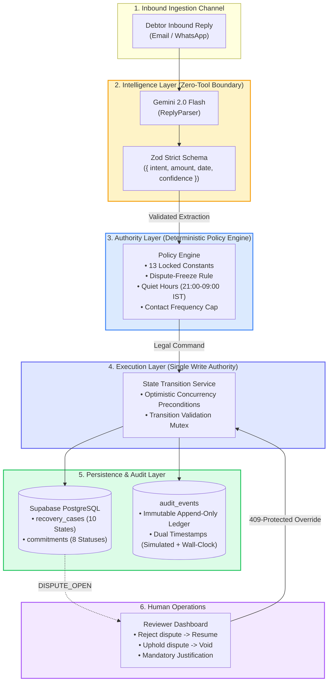

# Recoup — System Architecture

This document describes the complete architecture, data flow, state machine topology, and concurrency guarantees of the Recoup P2P Recovery Agent.

---

## 1. Architectural Principles

Recoup is engineered around five fundamental fintech architecture constraints:

1. **Separation of Intelligence from Authority**:
   - The LLM parses, extracts, and drafts text.
   - The Policy Engine validates rules, horizons, and thresholds.
   - The State Transition Service executes database mutations.
   - **The LLM never directly executes tools or mutates database state.**

2. **Single Authorized Write Path**:
   - `recovery_cases.state` and `commitments.status` cannot be updated through arbitrary API routes.
   - All mutations execute through `StateTransitionService` with optimistic locking (`.eq('state', expectedState)`).

3. **Immutable Audit Ledger**:
   - Every state transition, LLM parse, and human override appends a permanent row to `audit_events`.
   - Update and Delete operations are revoked at the database level.

4. **Dual-Timestamp Tracking**:
   - `simulated_time` drives all domain logic, quiet hours, promise due dates, and relative time calculations.
   - `real_wall_clock_time` records physical execution time for non-repudiation.

5. **Dispute-Freeze Financial Invariant**:
   - Debtor disputes freeze active promises (`is_frozen = true`) rather than cancelling them.
   - Preserves legal and financial evidence until a human reviewer renders a determination.

---

## 2. Component Topology



---

## 3. Two-Tier State Machine

Recoup implements two distinct, synchronized state machines ([ADR 0001](adr/0001-two-tier-state-machine.md)):

### A. Recovery Case States (`recovery_cases.state`)
Tracks the overall lifecycle of an overdue invoice:
- `OPEN`: Initial ingestion from ERP/billing system.
- `AWAITING_REPLY`: Outbound outreach sent; awaiting debtor response.
- `REPLY_PROCESSING`: Inbound message received; LLM parsing in progress.
- `COMMITMENT_ACTIVE`: Debtor promise validated by Policy Engine.
- `COMMITMENT_PARTIALLY_KEPT`: Debtor paid &ge; 90% tolerance.
- `COMMITMENT_BROKEN`: Promised date elapsed without settlement.
- `DISPUTE_OPEN`: Debtor raised dispute; active commitment frozen.
- `GHOSTED`: Max contact attempts reached with zero debtor response.
- `ESCALATED`: Escalation ladder triggered &rarr; human review or collections handoff.
- `CLOSED_PAID` / `CLOSED_PARTIAL` / `CLOSED_WRITTEN_OFF`: Terminal settlement states.

### B. Commitment Statuses (`commitments.status`)
Tracks the financial lifecycle of an individual payment promise:
- `CANDIDATE`: Raw parsed extraction awaiting policy validation.
- `VALID_ACTIVE`: Validated promise with active monitoring (`is_frozen = false`).
- `KEPT`: Webhook confirmed full payment on schedule.
- `PARTIALLY_KEPT`: Webhook confirmed payment &ge; 90% of promised amount.
- `BROKEN`: Promised due date passed with no payment webhook.
- `VOIDED_BY_DISPUTE`: Human reviewer upheld debtor dispute.
- `SUPERSEDED`: Replaced by a renegotiated promise.
- `INVALIDATED`: Failed policy validation (e.g. >90 days horizon).

---

## 4. Concurrency & Double-Submit Protection

To guarantee financial safety under concurrent operational loads:

1. **Optimistic State Preconditions**:
   Every state mutation query enforces `.eq('state', expectedState)`. If another background worker or human reviewer transitioned the case in the interim, the update returns `409 Conflict`.
2. **Double-Submit Proof**:
   Parallel duplicate requests sent at the exact same millisecond result in exactly one successful state transition and one `409 Conflict`, appending exactly one audit record.

---

## 5. Dual-Timestamp Engine

```
Event: dispute_detected_commitment_frozen
├── simulated_time:        2026-01-05T05:51:50.000Z   (Business Clock: Jan 5, 2026 · 11:21 AM)
└── real_wall_clock_time:  2026-08-25T13:48:35.947Z   (Physical UTC Server Timestamp)
```

- **`simulated_time`** governs all domain checks (Quiet Hours, Promise Horizons, Reminder Intervals) and relative UI time calculations (`"just now"`, `"2 days ago"`).
- **`real_wall_clock_time`** records the physical execution timestamp for immutable compliance logs.
